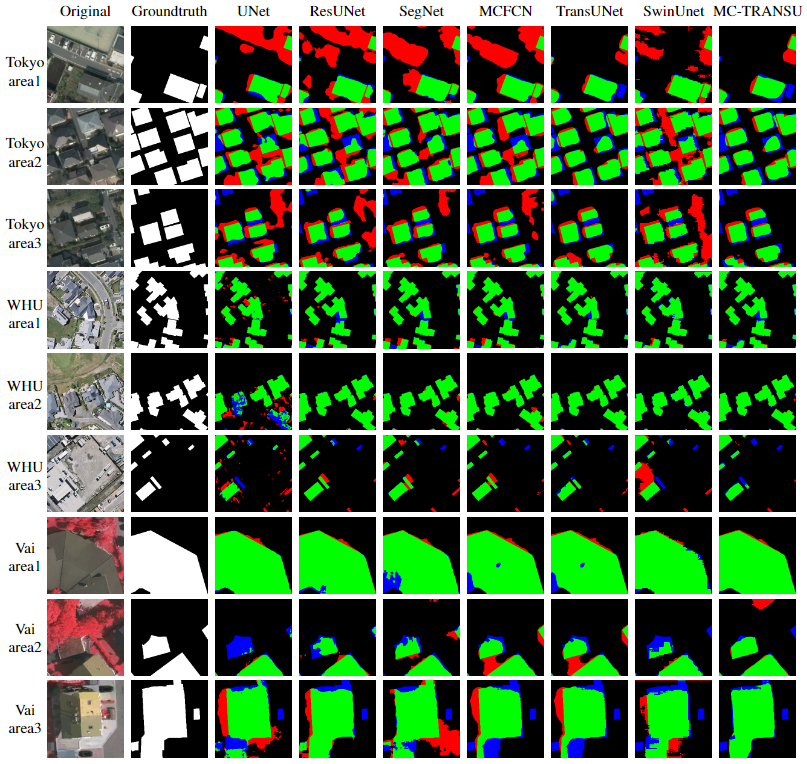

# Multi-Constraint-Transformer-based-Automatic-Building-Extraction-from-High-Resolution-Remote-Sensing

This is the official implementation of our paper ***Multi-Constraint-Transformer-based-Automatic-Building-Extraction-from-High-Resolution-Remote-Sensing*** accepted by IEEE J-STARS. Code will be coming soon.

## Install
    conda env create -f environment.yaml
    conda activate mctu

## Training
### 1.Prepare dataset
Here we take Vaihingen dataset as an example. You can prepare other datasets in a similar way.

Vaihingen dataset can be downloaded from [ISPRS homepage](https://www.isprs.org/default.aspx);

Organize it in the following format:

    Vaihingen
    ├── top
    │   ├── top_mosaic_09cm_area1.tif
    │   ├── top_mosaic_09cm_area2.tif
    │   ├── ...
    ├── groundtruth
    │   ├── top_mosaic_09cm_area1.tif
    │   ├── top_mosaic_09cm_area1.tif
    │   ├── ...

Then run

    python prepare_vaihingen.py --data_dir /Path/to/Vaihingen/

this will generate a new directory named **Prepared_Vaihingen**

### 2.Download R50-ViT-B-16 pretrained checkpoint from [this link](https://console.cloud.google.com/storage/vit_models/) or run the script
    bash ./download_ckpt.sh

### 3.run
    python train.py

results will be saved in **training_log**

## Visual results
### Large-scale result

### Small-scale result

## Reference
This repo is mainly base on [TransUnet](https://github.com/Beckschen/TransUNet).

## Citations
If you find our work helpful, please cite our work:

    @ARTICLE{10265007,
        author={Yuan, Wei and Ran, Weihang and Shi, Xiaodan and Shibasaki, Ryosuke},
        journal={IEEE Journal of Selected Topics in Applied Earth Observations and Remote Sensing}, 
        title={Multiconstraint Transformer-Based Automatic Building Extraction From High-Resolution Remote Sensing Images}, 
        year={2023},
        volume={16},
        number={},
        pages={9164-9174},
        keywords={Transformers;Feature extraction;Buildings;Remote sensing;Computational modeling;Convolutional neural networks;Task analysis;Deep learning;Building extraction;multiconstraint;remote sensing image;Transformer},
        doi={10.1109/JSTARS.2023.3319826}
    }